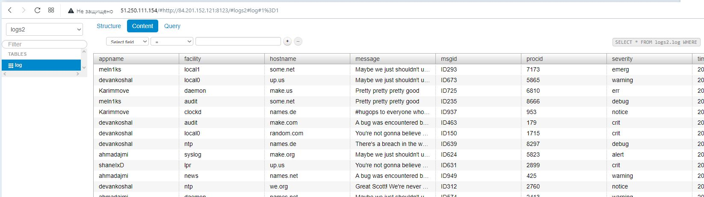

### 08-ansible-02-playbook

Playbook производит установку и настройку clickhouse, vector и lighthouse.

### Clickhouse
- установка clickhouse
- настройка удаленных подключений к приложению
- создание базы данных и таблицы в ней
### Vector
- установка vector
- изменение конфига приложения

### Lighthouse
- установка lighthouse
- настройка nginx
---

### Variables
- clickhouse_version, vector_version - версии устанавливаемых приложений;
- clickhouse_database_name - имя базы данных для хранения логов;
- clickhouse_create_table - структуру таблицы для хранения логов;

---

### Tags
- vector производит полную конфигурацию vector
- vector_config производит изменение в конфиге приложения vector
- lighthouse производит установку lighthouse

